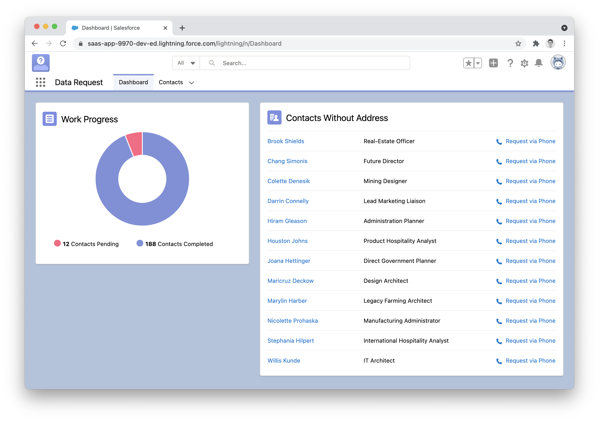

# Data Request

Sample project that uses Salesforce Functions to get addresses via phone.

[Watch the 60 seconds demo](https://github.com/marcelinollano/data-request/raw/main/media/demo.mp4)



## Setup

The setup has 3 pieces: the Lightning app running on the Salesforce Org, the Function itself running on the compute environment, and the Service that deals with Twilio on Heroku.

### 1. Lightning application

We start by login using `sfdx`:

```sh
npm install -g sfdx-cli
sfdx force:auth:web:login -a devhub
```

At the time of writing, for this whole thing to work you need to activate a few settings from Setup:

```sh
sfdx force:org:open -a devhub
```

1. Go to `Setup > Development > Dev Hub` and activate `Dev Hub` and `Source Tracking`.
2. Go to `Setup > Feature Settings > Functions` and activate it.

Then we create and push to our Scratch Org:

```sh
sfdx force:org:create -s -f config/project-scratch-def.json -a scratch
sfdx force:source:push -u scratch -f
```

A permset is provided to make the Function work correctly. Assign it to our Scratch Org:

```sh
sfdx force:user:permset:assign -n Functions -u scratch
```

We need some data to make our app work, so we import it using a plan from the `data` folder:

```sh
sfdx force:data:tree:import --plan data/Contacts-plan.json
```

You can now open the Lightning app, but it won't work until we setup the function.

```sh
sfdx force:org:open -u scratch
```

Search for `Data Request` from the waffle menu and voilà!

### 2. Function

Next we need to setup the Function. Start by login in:

```sh
sfdx login:functions
```

Then create the compute environment were the Function will be run:

```sh
sfdx env:create:compute -o scratch -a compute
```

Our Function uses the [Axios](https://www.npmjs.com/package/axios) library to call our Service that deals with Twilio's phone API. Create two variables to point to the service:

```sh
sfdx env:var:set SERVICE_URL=https://your-service.herokuapp.com --environment=compute
sfdx env:var:set SERVICE_TOKEN=XXXXXXXXXX --environment=compute
```

At this point we are ready to deploy our Function:

```sh
sfdx project:deploy:functions -o scratch
```

### 3. Service

The last piece is deploying our Twilio service. This is running on [Heroku](https://heroku.com), so let's login:

```sh
heroku login
```

Then create a new application:

```sh
heroku apps:create your-service
```

We need a bunch of environment variables for this to work. `SERVICE_TOKEN` is just a simple way to authenticate your Function with your Service and can be any string you like. The `TWILIO_` variables are provided by [Twilio](https://www.twilio.com) when you setup [Twilio Voice](https://www.twilio.com/voice):

```sh
heroku config:set SERVICE_URL=https://your-service.herokuapp.com
heroku config:set SERVICE_TOKEN=XXXXXXXXXX
heroku config:set TWILIO_ACCOUNT_SID=XXXXXXXXXXXXXXXXXXXXXXXXXXXXXXXXXX
heroku config:set TWILIO_AUTH_TOKEN=XXXXXXXXXXXXXXXXXXXXXXXXXXXXXXXXX
heroku config:set TWILIO_CALLER_ID=+1XXXXXXXXXX
```

Okay, finally we deploy to Heroku:

```sh
git subtree push --prefix services/twilio heroku main
```

You should not be able to click `Request via Phone` from the Lightning application andthe Function will send a call and save the transcript into Salesforce. Pretty cool!
